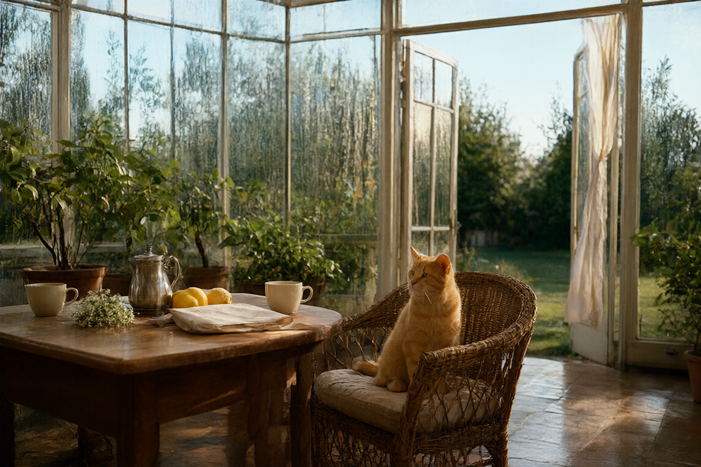
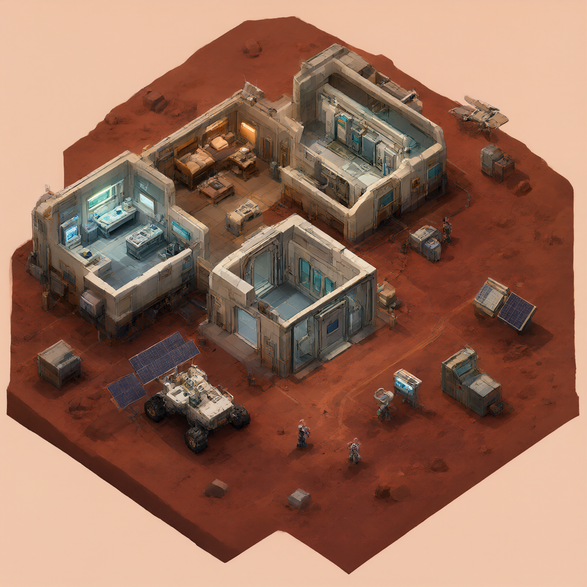
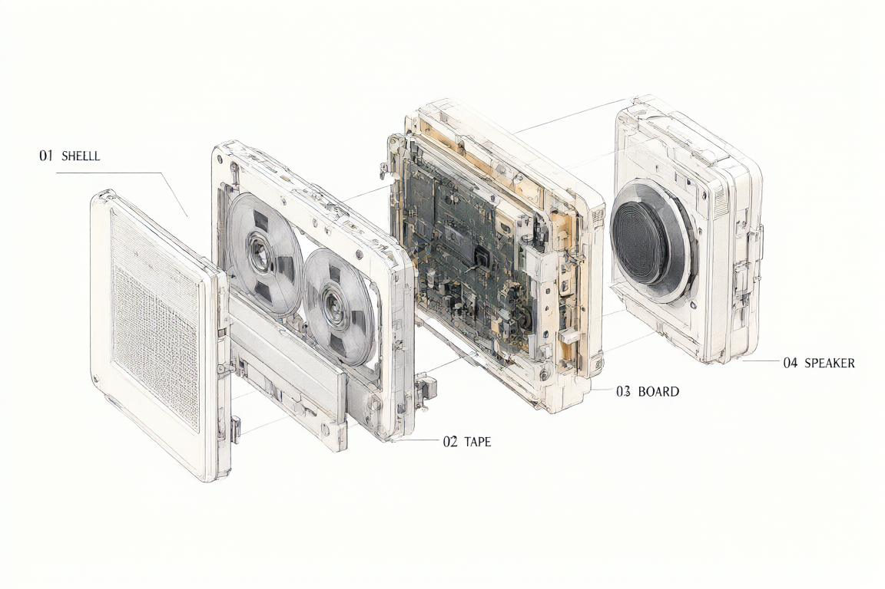

# MLX Image Kit

[English](README.md) · [Русский](README.ru.md)

**Локальная генерация изображений на Apple Silicon: Qwen-Image 2.1, собственный native 4-bit загрузчик MLX, поэтапная работа с памятью и необязательный кеш денойзинга.** Можно работать интерактивно, запускать отдельные задания из команды или выполнять последовательный batch. По умолчанию используется обычная генерация без кеша.



Qwen-Image 2.1 · native 4-bit MLX · Mac mini M4, 24 ГБ объединённой памяти<br>
1152×768 · 20 шагов · кеш `balanced`

## Одна модель — разные визуальные языки

Все изображения ниже созданы локально одной 4-битной моделью за 20 шагов. Это примеры возможностей, а не парные бенчмарки. Нажмите на изображение, чтобы открыть полный размер.

| Ксилография | Комикс 1970-х |
| --- | --- |
| <a href="assets/gallery/woodblock.png"></a> | <a href="assets/gallery/comic.png"></a> |
| **Изометрическая игровая сцена** | **Техническая иллюстрация в разборе** |
| <a href="assets/gallery/isometric.png"></a> | <a href="assets/gallery/exploded-view.png"></a> |
| **Плакат в стиле 1960-х** |  |
| <a href="assets/gallery/poster.png"></a> |  |

На плакате обе заданные строки читаются. Схема показывает короткие подписи, но её механика — художественная иллюстрация, **не инженерная сборочная документация**. Сгенерированный текст и мелкие детали нужно проверять перед публикацией.

## Измерения `off` и `balanced`

`off` выполняет обычный цикл денойзинга. `balanced` может повторно использовать результат transformer, когда соседние шаги достаточно похожи. Кеш включается только явно; по умолчанию выбран **`off`**.

| 1152×768 · 20 шагов | Всего, `off` | Всего, `balanced` | Ускорение денойзинга | SSIM |
| --- | ---: | ---: | ---: | ---: |
| Парный тест 1 | 377.08 с | 227.49 с | 1.67× | 0.9645 |
| Парный тест 2 | 448.13 с | 299.06 с | 1.53× | 0.9732 |

Это два измеренных задания на Mac mini M4 с 24 ГБ объединённой памяти, не изображения из галереи. Результат зависит от prompt и компьютера; визуальные отличия возможны. Эталонным остаётся режим `off`. Состояние кеша создаётся заново для каждого изображения, в том числе в batch. Механизм написан специально для проекта, с опорой на идеи [TeaCache](https://arxiv.org/abs/2411.19108) и [Cache-DiT](https://github.com/vipshop/cache-dit); это не прямой порт.

## Быстрый старт

Нужны Mac с Apple Silicon и Python 3.12 или новее. Конфигурация, на которой проводились измерения, указана выше; другие объёмы памяти здесь не проверялись.

```sh
git clone https://github.com/proovcme/mlx-image-kit.git
cd mlx-image-kit
python3.12 -m venv .venv
. .venv/bin/activate
python -m pip install .
mlx-image
```

При первом запуске недостающие файлы модели загружаются в кеш Hugging Face. Для уже имеющегося snapshot укажите `--model-path PATH`. Веса в репозиторий не входят. Перед использованием прочитайте [лицензию модели](#модель-и-лицензия).

В интерактивном режиме короткий prompt запускается сразу. Для нескольких абзацев используйте `/paste`:

```text
image › /paste
Paste your prompt below.
Finish with /end · cancel with /cancel
│ A red ceramic teapot on a worn wooden table.
│
│ Soft daylight through an old window.
│ /end
```

Пустые строки и Unicode сохраняются. Генерация начинается только после `/end`; `/cancel` отменяет ввод. В сводке запуска prompt не повторяется.

### Команды интерактивного режима

| Команда | Действие |
| --- | --- |
| `/portrait`, `/landscape`, `/square` | Размер 768×1152, 1152×768 или 1024×1024 |
| `/size WIDTHxHEIGHT` | Размер с кратностью сторон 16 |
| `/steps N` | Число шагов денойзинга |
| `/seed N` или `/seed random` | Фиксированный или случайный seed |
| `/guidance X` | Значение guidance |
| `/cache off` или `/cache balanced` | Обычный или ускоренный режим |
| `/status` | Текущие настройки, включая режим кеша |
| `/paste`, `/end`, `/cancel` | Ввод, завершение и отмена многострочного prompt |
| `/last`, `/history`, `/repeat` | Просмотр и повтор локальных заданий |
| `/open` | Открыть последний PNG в macOS |
| `/help`, `/quit` | Справка и выход |

Значения по умолчанию: 1152×768, 20 шагов, guidance 1.0, случайный seed, кеш `off`. `/repeat` восстанавливает полный prompt, seed, размер, guidance, шаги и режим кеша. Старые записи history без поля cache считаются режимом `off`.

### Прямой запуск

```sh
python generate.py \
  --prompt "A red ceramic teapot on a wooden table" \
  --output output.png \
  --width 1152 --height 768 \
  --steps 20 --seed 1977 --guidance 1.0 \
  --cache balanced
```

Без `--cache` используется обычный режим. Явное `--cache off` тоже поддерживается. Для локального snapshot служит `--model-path PATH`.

### Последовательный batch

В `.txt` записывается по одному prompt на непустую строку. В `.jsonl` для каждого задания можно задать `output`, `width`, `height`, `steps`, `seed` и `guidance`:

```jsonl
{"prompt":"A red ceramic teapot on a wooden table","output":"image-a.png","width":1152,"height":768,"steps":20,"seed":1977,"guidance":1.0}
{"prompt":"A small wooden cabin by a lake","output":"image-b.png","width":768,"height":1152,"steps":20,"seed":42,"guidance":1.0}
```

```sh
mlx-image batch local/prompts.txt --cache balanced
mlx-image batch local/jobs.jsonl --cache balanced --output-dir outputs/
```

Для всего batch по умолчанию действует `off`. `--count N` создаёт N вариантов каждого prompt; при фиксированном seed число увеличивается для каждого варианта. Задания выполняются последовательно и используют один загруженный transformer, но каждое получает новое состояние кеша. Ошибка выводится по номеру задания без печати prompt. Полный список параметров: `mlx-image batch --help`.

## Зачем нужен native Q4 loader

Рабочий путь в [`mlx_image/engine.py`](mlx_image/engine.py) загружает локальный 4-битный snapshot Qwen-Image 2.1 собственным загрузчиком. Штатный загрузчик mflux или Hugging Face его не заменяет.

| Компонент | Загрузка |
| --- | --- |
| Text encoder | Создать `Qwen21TextEncoder`; квантизовать в affine 4-bit с group size 64; сопоставить 904 ключа из `language_model.model.*`; загрузить с `strict=True`. Порядок: **quantize → remap → strict load**. |
| Transformer | Создать native Q4 `Qwen21Transformer` с group size 64; переназначить `modulation.0.*` в `modulation.layers.1.*` и `time_text_embed.linear_*` в `time_text_embed.timestep_embedder.linear_*`; загрузить с `strict=True`. В проверенном локальном snapshot требуются 3 + 6 таких переназначений. |
| VAE | Сопоставить `.gamma`/`.beta` и пути свёрточных слоёв, затем выбрать только ключи с подходящей формой тензора. Как и в исходном рабочем прототипе, обновление VAE использует `strict=False`. |

Работа разбита на этапы: кодирование prompts и освобождение text encoder; загрузка transformer, денойзинг и освобождение; загрузка VAE, декодирование и сохранение PNG. В batch промежуточные массивы временно сохраняются на диск, а каждый тяжёлый компонент загружается один раз.

## Модель и лицензия

[Лицензия MIT](LICENSE) относится к коду этого репозитория, **не к весам модели**. По умолчанию используются веса [`mlx-community/Qwen-Image-2.1-MLX-4bit`](https://huggingface.co/mlx-community/Qwen-Image-2.1-MLX-4bit). Лежащая в основе [Qwen Research License](https://huggingface.co/Qwen/Qwen-Image-2.1/blob/main/LICENSE) ограничивает использование материалов модели некоммерческими исследованиями и оценкой; для коммерческого применения нужна отдельная лицензия. Перед использованием прочитайте полный текст.
